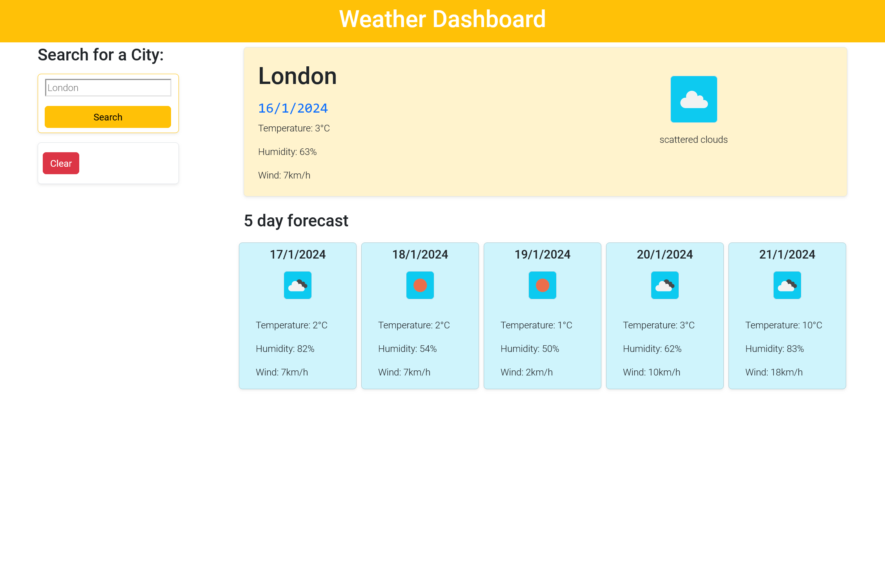

# weather-forecat-api

# Table of content

[Overview](#Overview)
[Screenshots](#Screenshots)
[Links](#Links)
[My_process](#My_process)
[Built_with](#Built_with)
[What_I_learned](#What_I_learned)
[Continued_developement](#Continued_developement)
[Author](#Author)
[Sources](#Sources)

# Overview
Create a weather dashboard with form inputs.
When a user searches for a city they are presented with current and future conditions for that city and that city is added to the search history
When a user views the current weather conditions for that city they are presented with:
-The city name
-The date
-An icon representation of weather conditions
-The temperature
-The humidity
-The wind speed
When a user view future weather conditions for that city they are presented with a 5-day forecast that displays:
-The date
-An icon representation of weather conditions
-The temperature
-The humidity
I set London as default city. If user doesn't chose any city, London current and 5 days forecast are displayed.

When a user click on a city in the search history they are again presented with current and future conditions for that city
I finished the challenge using jQuery and events around local storage.

## Screenshots
[show listed cities](./assets/images/Screenshot%202024-01-16%20at%2021-45-06%20Weather%20Dashboard.png)

[wireframe](./assets/images/wireframe.jpg)
# Video
[show how the site works](./assets/images/Weather%20Dashboard%20—%20Mozilla%20Firefox%202024-01-16%2022-04-10.mp4)

### Links
the github page of the solutin[https://github.com/hszilvi/weather-forecast-api]
live link[https://hszilvi.github.io/weather-forecast-api/] This is blocked because of API / check on mp4 linked in readme

## My_process
At first I created the HTML file with bootstrap. Applied for an API key to use OpenWeather. At first I created the search and store City component than displayed the current weather data. 
For 5 day forecast I displayed the midday data.

### Built_with
Javascript, jQuery, dayjs, Bootstrap, OpenWeather API, VS code

## What_I_learned
I learned a lot about APIs and how to fetch data.

### Continued_developement
API

## Author
Szilvia Horvath
GitHub[https://github.com/hszilvi]
LinkedIn[https://www.linkedin.com/in/horvathszilvi/]

# Sources
https://openweathermap.org/forecast5
https://www.youtube.com/watch?v=MIYQR-Ybrn4&t=1894s
